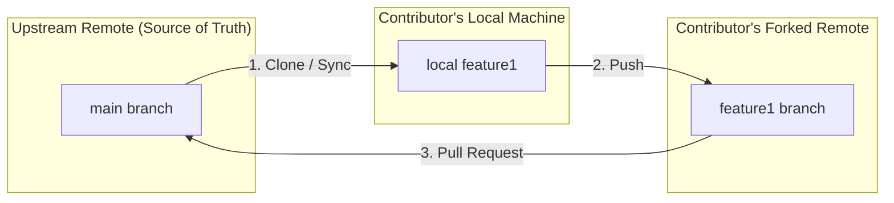
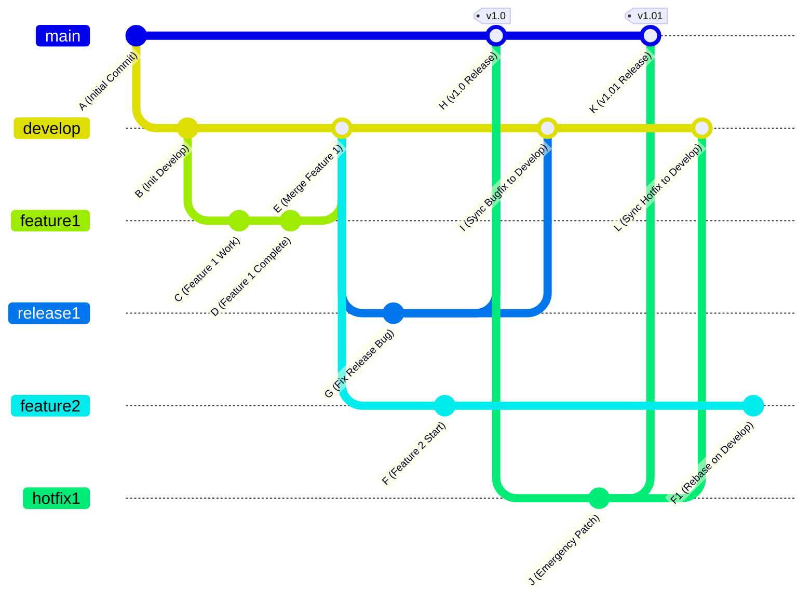

# Comprehensive Guide: Git Workflows & GitFlow Mechanics

A Git workflow is a set of guidelines or conventions that defines how a team uses Git to build software. Because Git is fully decentralized and flexible, teams can adapt these patterns to fit their specific project scale, release cadence, and access requirements.

---

## 1. Overview of Primary Git Workflows

### 1. Centralized Workflow

- **Structure:** Single remote repository using a single branch (typically `main` or `master`).
- **Mechanism:** Every developer clones the central repository, works locally, and pushes back to the primary branch.
- **Synchronization:** If another team member has pushed changes since your last fetch/pull, you must `fetch` and `merge` (or `rebase`) their work before Git will allow you to `push`.
- **Pros & Cons:** Simple to understand, but misses out on isolated code reviews, pull requests, and feature isolation.

### 2. Feature Branch Workflow

- **Structure:** Single remote repository with one main branch (`main`/`master`) and dedicated short-lived branches.
- **Mechanism:** All feature work, bug fixes, or experimental updates occur in isolated topic branches (e.g., `feature/login-page`).
- **Pull Requests:** Changes are integrated into the main branch via Pull Requests (PRs), enabling peer code reviews and discussion before merging.

### 3. Forking Workflow

- **Structure:** Multiple remote repositories (Upstream repository + individual Forked repositories).
- **Mechanism:**
- **Upstream Repository:** The canonical "source of truth" maintained by core owners.
- **Forked Repository:** A personal server-side copy owned by a contributor.

- **Access Control:** Contributors do not need direct write access to the Upstream repository. They push changes to their personal fork and open a cross-repository Pull Request.
- **Synchronization Challenge:** The contributor is responsible for keeping their local and forked repositories synchronized with the Upstream repository before opening or updating PRs. Common in open-source projects.



---

## 2. Deep Dive: GitFlow Workflow

GitFlow provides a structured framework designed around scheduled release cycles and hotfix management. It uses strict branching rules to ensure stability on production while enabling parallel feature development.

### Branch Classifications

| Branch Type           | Lifetime     | Purpose                                                                                   | Source Branch | Merges Into                |
| --------------------- | ------------ | ----------------------------------------------------------------------------------------- | ------------- | -------------------------- |
| **`master` / `main**` | Long-running | Represents production-ready, deployed state. Every commit is tagged with a version.       | N/A           | N/A                        |
| **`develop`**         | Long-running | Serves as the integration branch for completed features intended for the next release.    | `master`      | N/A                        |
| **`feature/*`**       | Short-lived  | Contains work for specific new features or updates.                                       | `develop`     | `develop`                  |
| **`release/*`**       | Short-lived  | Prepares a new release candidate; restricted to bug fixes, documentation, and minor prep. | `develop`     | `master` **AND** `develop` |
| **`hotfix/*`**        | Short-lived  | Quickly patches urgent bugs discovered in production.                                     | `master`      | `master` **AND** `develop` |

---

## 3. Step-by-Step GitFlow Execution Trace

The diagram below tracks the lifecycle of features, releases, and hotfixes across long-running and short-lived branches.



### Key Execution Milestones

1. **Initialization:** `master` starts with initial commit `A`. The `develop` branch is created from `master` at commit `B`.
2. **Feature Isolation (`feature1`):** Created from `develop`. Work happens in `C` and `D`. It merges back into `develop` as merge commit `E`.
3. **Release Preparation (`release1`):** Created from `develop` at commit `E` (the release candidate).

- While testing `release1`, bug fix commit `G` is applied directly to `release1`.
- In parallel, work on future features (`feature2`) continues off `develop` (commit `F`).

4. **Publishing Release 1:**

- `release1` merges into `master` at commit `H` and receives tag `v1.0`.
- **Critical Rule:** `release1` is also merged back into `develop` at commit `I` so that bug fix `G` is not lost in future releases.

5. **Emergency Hotfix (`hotfix1`):**

- A critical bug is found in production (`v1.0`).
- `hotfix1` branches directly off `master` (skipping `develop` to avoid picking up unreleased features).
- Bug patch `J` is committed.
- `hotfix1` merges into `master` at `K` and is tagged `v1.01`.
- **Critical Rule:** `hotfix1` is also merged into `develop` at commit `L` to retain the patch.

---

## 4. GitFlow Core Operational Rules

1. **Production Direct Commit Restriction:** Work is never committed directly to `master` (except for the initial repository commit). All additions to `master` must arrive via merge commits from `release/*` or `hotfix/*` branches.
2. **Double-Merge Rule:** Whenever changes are merged into `master` from a `release` or `hotfix` branch, those changes **must also be merged into `develop**`. Failure to do so causes bug regressions in subsequent releases.
3. **Rebasing In-Flight Features:** When `develop` moves ahead due to release or hotfix synchronization (commits `I` and `L`), feature branches (`feature2`) should rebase onto `develop` to incorporate the latest fixes into their ongoing work stream.

---

## 5. Course Final Project Reference: Commit Map

The final project requires reproducing the extended commit graph incorporating feature rebases:

```
[master]   (A)-------------------------(H v1.0)------------(K v1.01)
            \                         /                   /
[release1]   \                   (G)-+                   /
              \                 /                       /
[hotfix1]      \               /                    (J)+
                \             /                       /
[develop]        (B)-------(E)-----------------(I)---+-----------(L)
                   \       /                    \                 \
[feature1]          (C)-(D)                      \                 \
                                                  \                 \
[feature2]                                         (F)---[Rebase]--->(F1)---[Rebase]--->(F2)

```

### Rebase Tracking Log for `feature2`:

- **Initial State:** `feature2` branches from `develop` at commit `E` and records work commit `F`.
- **First Rebase (`F1`):** Once `release1` is merged back into `develop` at commit `I`, `feature2` rebases onto `develop`, transforming commit `F` into `F1`. This pulls in bug fix `G`.
- **Second Rebase (`F2`):** Once `hotfix1` is merged back into `develop` at commit `L`, `feature2` rebases onto `develop` again, transforming `F1` into `F2`. This pulls in hotfix patch `J`.
